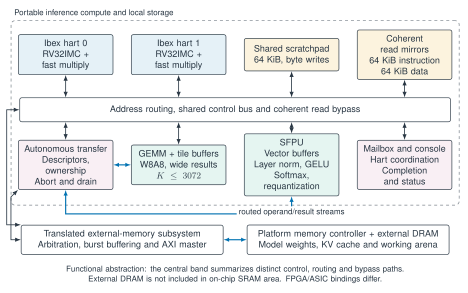
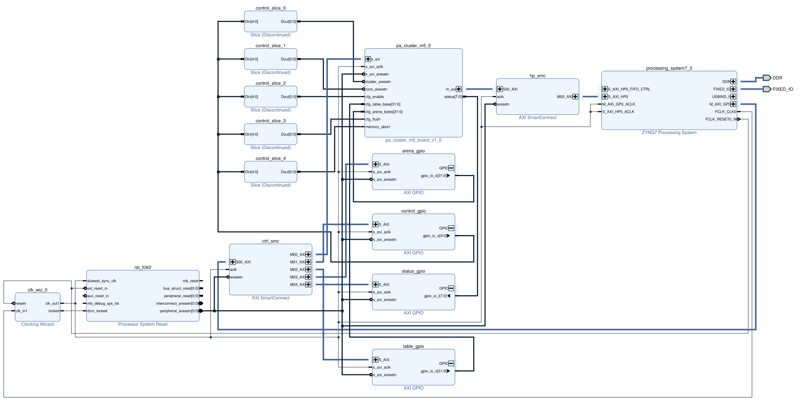
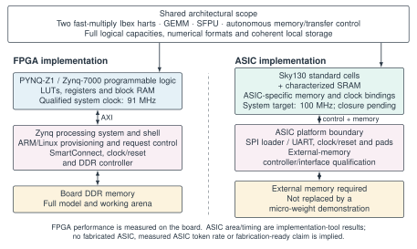
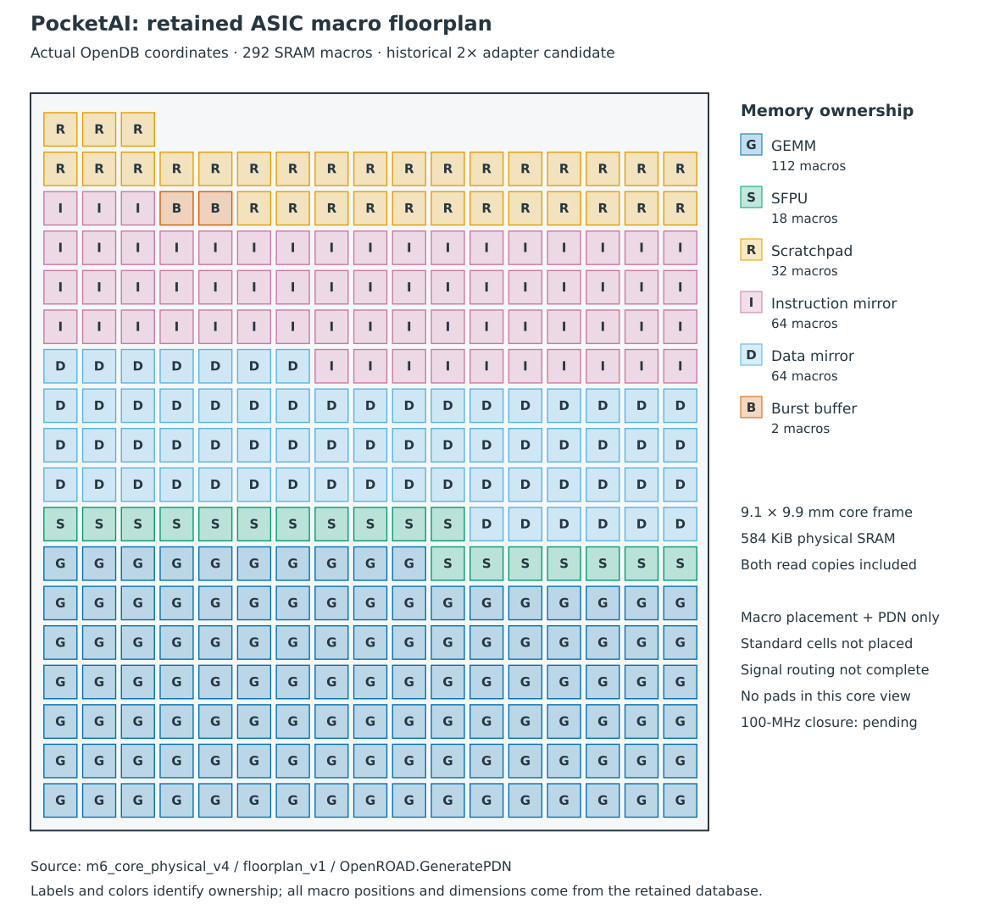

# PocketAI FPGA results and Sky130 port

Status: **preliminary M6 report; M6 is not closed.** The qualified FPGA release
is `7405919`. The historical two-phase SRAM port passes functional tests,
synthesis and macro-placement/power-grid connectivity checks. The new
single-clock candidate passes full-system RTL and digital loader tests but does not yet pass
the representative banked-memory physical checks. Neither result describes
a routed, timing-closed full chip or measured ASIC inference.
Acceptance is recorded in [M6_PLAN.md](M6_PLAN.md).

On 2026-09-08, the user initially deferred and then reinstated the 100-MHz
ASIC closure requirement, approving a memory-first implementation roadmap.
After the subsequent bounded contract pass, the user explicitly accepted
**95 MHz with approximately +0.244 ns setup headroom**. The +0.250-ns margin
is preferred, not an exact cutoff; +0.500 ns remains stretch. Full-system
closure at this revised clock remains unachieved. This changes frequency and
the accepted setup margin, not the other qualification gates. The earlier
12.5-MHz system / 25-MHz memory candidate is historical and unqualified.
This acceptance change does not alter the existing
100-MHz SRAM probe results. The user subsequently approved deferring SRAM-internal
verification and unavailable leakage data for a research-only result. Those
gaps remain unqualified; the deferrals do not waive our full-system functional,
macro-boundary timing, routing or power-connectivity checks.

## System and evidence boundary

PocketAI runs the full quantized GPT-2 model on two fast-multiply Ibex harts,
a GEMM engine and an SFPU in PYNQ-Z1 programmable logic. The numerical path
uses W8A8 weights/activations and int16 intermediate representations. The ARM
host provisions the model, controls requests and checks results; it does not
replace the inference computation in the reported measurements.

The ASIC port must retain both harts, the accelerators, autonomous transfer
control, scratchpad and coherent read mirrors. The Zynq processing system,
DDR controller/PHY, interconnect shell and FPGA-specific clock/pad primitives
are platform infrastructure. The external memory arena is not an on-chip SRAM.
An ASIC interface must replace that platform boundary before full-system
throughput can be evaluated. No FPGA-to-ASIC clock scaling is used here.

The [preflight ledger](m6_preflight_evidence.json) records primary-artifact
hashes and tool outputs. Physical-board measurements come from the frozen
[startup evidence](m5_startup_evidence.json); implementation area and static
timing are tool results, not physical ASIC measurements. Missing results are
marked unavailable. A missing number is not zero.
The [port ledger](m6_port_evidence.json) records historical two-phase full-system
functional, synthesis, block-area and floorplan evidence. The
[100-MHz experiment ledger](m6_100mhz_evidence.json) separately records the
single-clock candidate, its consumer assertions and the new routed bank probes.
Small [primary log/report extracts](evidence/m6_100mhz/manifest.json) are tracked
with the report; complete EDA runs remain retained locally and hash-bound.
The [post-storage extracts](evidence/m6_memory_resumed_v2/manifest.json) add the
electrical screen, local-clock trial and single-clock loader evidence.
The [SRAM-contract ledger](m6_sram_contract_evidence.json) adds the output-only
metadata correction, isolated-inverter sanity check, failed physical repair
trials and direct 95-MHz setup/hold result. Its
[primary extracts](evidence/m6_sram_contract/manifest.json) are separate from
the unchanged historical bundles.

## Architecture and implementation figures



Figure 1. Portable inference architecture. Both fast-multiply Ibex harts,
coherent read mirrors, scratchpad, GEMM, SFPU and autonomous transfer/control
are retained. The central band summarizes distinct control, routing and bypass
paths; it is not a literal single bus. The translated external-memory subsystem
is portable RTL, while the DRAM controller/PHY is a platform boundary.
[Editable TikZ](figures/m6/architecture.tex) · [Vector PDF](figures/m6/architecture.pdf).



Figure 2. Native Vivado export of the qualified-release system block design,
opened read-only. `pa_cluster_m5_0` contains the inference core. Its AXI master
reaches Zynq DDR through `hp_smc` and the processing system's HP0 port; the
GP0/control path provides host access and configuration. Clock/reset and GPIO
blocks belong to the FPGA shell. The retained layout is exported, not redrawn
or rebuilt, and “Discontinued” labels are Vivado's IP display annotations.
[Vector PDF](figures/m6/vivado_system.pdf).



Figure 3. Architectural reuse and platform-specific implementation boundaries.
The FPGA's 91-MHz clock is qualified. The figure's ASIC 100-MHz target label
predates the user's subsequent 95-MHz approval; neither is an achieved ASIC
clock. The final figure must reflect the qualified implementation.
The ASIC loader has digital RTL evidence, while its physical pads and external
memory interface still require integration. No fabricated-ASIC measurement is
implied. [Editable TikZ](figures/m6/platforms.tex) · [Vector PDF](figures/m6/platforms.pdf).



Figure 4. Labeled vector view of actual macro coordinates from the retained
OpenROAD `m6_core_physical_v4/floorplan_v1` database. All 292 SRAM macros are
shown, including duplicated read copies. This historical two-phase candidate
has macro placement and PDN connectivity evidence only; standard cells are
not placed and signal routing is incomplete. It is neither the new single-clock
candidate nor a 100-MHz result. Letter labels preserve ownership in grayscale.
[Vector PDF](figures/m6/asic_floorplan.pdf) · [Actual OpenROAD GUI export](figures/m6/asic_openroad.png).

The [figure manifest](figures/m6/manifest.json) records source and output hashes.
Native TikZ sources remain editable. Tool exports retain their actual source
stage, and the [figure reproduction notes](figures/m6/README.md) separate native
EDA exports from the labeled geometry visualization. A final routed ASIC view
must replace the preliminary view only after that implementation is qualified.

## Qualified FPGA implementation

The frozen implementation operates at 91 MHz. Its reported setup slack is
+0.269 ns and hold slack is +0.008 ns, with zero total negative setup and hold
slack. Vivado reports 29,229 LUTs, 21,833 registers, 127.5 BRAM36 equivalents
and no DSP blocks. The FPGA audit passed again before starting M6. These
numbers are the qualified implementation, not a new ASIC result.

| Metric | Full FPGA system | Full-system ASIC |
|---|---:|---|
| Qualified operating clock | 91 MHz | Unavailable; 100-MHz closure required |
| LUTs / registers | 29,229 / 21,833 | Not applicable |
| BRAM36 equivalents / DSPs | 127.5 / 0 | Not applicable |
| Mapped standard-cell / SRAM instance area | Not inferred from LUTs | Historical 2x synthesis: 2.162388 / 58.081312 mm² |
| Full-layout setup / hold slack | +0.269 / +0.008 ns | Unavailable |
| Maximum achievable frequency | Not characterized by a clock sweep | Unavailable |
| Measured board watts | Explicitly deferred by user | No fabricated ASIC |
| Qualified activity-based ASIC power | Not applicable | Unavailable |

The qualified routed checkpoint was opened read-only for hierarchical
utilization reports and a primitive inventory. Synthesis had flattened much
of the combinational logic. Grouping remaining names therefore does not recover
reliable per-block LUT ownership, and shared LUT sites can appear in multiple
groups. Those diagnostic groups are retained but are not a per-block PPA table.
A separate hierarchy-preserving, out-of-context synthesis now provides block
attribution. It uses the same qualified functional sources and explicitly
forbids DSP inference in the fast multipliers. The initial experiment inferred
two DSPs despite the global limit and was rejected as a matched comparison.
The retained second run uses zero DSPs. Neither run replaces the qualified
routed checkpoint or its measured performance.

| FPGA block, separate synthesis | LUTs | Flip-flops | BRAM36 equivalents |
|---|---:|---:|---:|
| Hart 0 | 3,319 | 1,059 | 0 |
| Hart 1 | 3,215 | 1,059 | 0 |
| GEMM, including its buffers | 11,069 | 8,242 | 64 |
| SFPU, including its buffers/ROMs | 3,484 | 2,450 | 15 |
| Memory, mirrors, other control and boundary | 3,267 | 3,137 | 48.5 |
| Total portable core | 24,354 | 15,947 | 127.5 |

The final row excludes the Zynq platform shell. Inferred scratchpad/mirror
logic is included in the combined memory/control row because synthesis absorbs
those arrays into the enclosing module. This table reports synthesis resources,
not placed FPGA area, and does not convert LUTs into square millimeters.
Primary reports are `build/m6_fpga_blocks_v2/{full,hierarchy}.rpt`.

## Measured FPGA inference performance

Each row below contains three unprofiled requests using the original prompt
and complete model. Delivered time starts at START and ends after safe DMA
return and copying the output tokens. It includes actual prompt processing,
first-use preparation, inference and delivery control. Provisioning, model/
overlay/firmware loading and independent result checking are outside this
request interval and recorded separately in the frozen campaign.

| Request | Generated tokens | Mean delivered time | Pooled output throughput |
|---|---:|---:|---:|
| Science | 1 | 9.993854 s | 0.100061 token/s |
| Computing | 1 | 9.994739 s | 0.100053 token/s |
| Story | 2 | 16.603659 s | 0.120455 token/s |

The slowest one-token request took 9.996906 s, leaving approximately 3.094 ms
against the 10-s threshold. This is a narrow measured pass on these requests,
not a sustained-throughput, arbitrary-prompt or tail-latency guarantee. Cached
maximum-context forwards and cold derived-cache preparation are different
workloads; their results are retained in [M5_STARTUP_RESULTS.md](M5_STARTUP_RESULTS.md).

GEMM compute-only GMAC/s does not measure complete GPT-2 throughput. This report
does not reuse a historical microbenchmark as current end-to-end performance,
or infer an ASIC token rate from the FPGA clock ratio. Matched current compute
and interface-bandwidth measurements remain to be added for the ASIC scope.

## ASIC source and memory feasibility

The complete portable system elaborated through sv2v and Yosys with both fast
Ibex harts present. The stage checks 178 qualified source files against the
frozen evidence before copying them into an M6 directory. Two transformations
are explicit: binding the qualified generic latch-based clock gate in place of
the FPGA clock primitive, and rewriting two packed zero-valued I-cache
configuration patterns into equivalent replication syntax. The caches remain
disabled. Elaboration alone is not functional equivalence or ASIC synthesis.

The hierarchy inventory contains 70 memory instances and 3,509,017 logical
bits before memory optimization. It includes initialized ROMs and small
multiported arrays as well as the bulk data memories. These counts are neither
the physical SRAM allocation nor an ASIC area result. The read-clock masks are
observed before Yosys merges output registers into memories; they must not be
interpreted as evidence that every source memory has asynchronous reads.

The first dual-port OpenRAM candidate was rejected as simulated timing/power
evidence because its retained generation log explicitly uses analytical Elmore
characterization. The SRAM22 candidate provides Liberty views with a Liberate
characterization header at slow, typical and fast corners. Its original GDS,
LEF, behavioral model, SPICE and Liberty files are pinned and retained.
The authors describe SRAM22 as work in progress and distinguish its external
installation from proprietary DRC/LVS/PEX/simulation integrations.
[SRAM22 documentation](https://github.com/ucb-substrate/sram22).

## Complete memory port and functional results

The ASIC stage additionally binds Ibex's resettable flip-flop register file;
both `RV32MFast` units remain unchanged. Forty-seven logical arrays map to
292 physical 512 × 32 SRAM22 macros. They contain 3,449,856 logical mapped bits
and allocate 4,784,128 physical bits (584 KiB). Twenty-one small asynchronous
buffers, control arrays and constant ROM instances remain explicit synthesized
logic. They are included in area, not omitted memories.

SRAM22 has one read-or-write port. The historical adapter services a read and then a write
at twice the system clock, preserving simultaneous logical reads/writes and
read-before-write collisions. Two-read arrays have two physical copies with
broadcast writes. Banking, byte masks, width padding and duplication are fully
charged to area. The [memory contract](M6_MEMORY_PORT.md) defines the clock phase
and reset behavior. This port does not reduce the logical model or memory sizes.
The retained two-phase revision uses a separate set-high phase-data register in each
logical adapter. Synthesis retains all 47 phase registers separately from the
reset-low system-clock divider. The memory test checks their phase alignment
through reset, and both full-system and digital-chip tests pass again.

Three adapter configurations passed byte masks, bank boundaries, concurrent
collisions, disabled-read hold, command capture and reset retention. The full
dual-hart accelerator oracle then passed two boots, packet-abort recovery,
9,633 independently checked words per boot and all 14 lifecycle cases.
The total 16,477,049 system cycles match the frozen FPGA-model baseline exactly.
Firmware and numerical/lifecycle oracles were unchanged; only the top name and
two-phase clock servicing changed. These are RTL simulation results, not
post-layout timing or physical ASIC measurements.

The first assembled netlist left padded out-of-range ROM values as undriven
wires. Its final optimized synthesis check was clean, but the pre-synthesis
check reported 39,127 undriven-bit problems. The next assembly explicitly normalizes
undriven values to Verilog unknowns with `opt_expr -undriven`, preserving
don't-care semantics rather than silently supplying a RAM implementation.
That assembly passes strict `check -assert`, the complete unchanged firmware
oracle and the synthesis checker. Failed trials remain available.

## ASIC block area and physical progress

The following historical two-phase values sum actual mapped standard-cell library areas and the
pinned SRAM LEF area. They are **synthesis-only instance areas**, not routed
die areas. The hierarchy-preserving synthesis retains ownership before final
flattening; every final cell is assigned once. The [area extractor](../scripts/m6_block_areas.py)
checks the standard-cell sum against the synthesis report.

| ASIC block | Standard cells (mm²) | SRAM macros | SRAM (mm²) | Total instances (mm²) |
|---|---:|---:|---:|---:|
| Hart 0 | 0.170121 | 0 | 0 | 0.170121 |
| Hart 1 | 0.170121 | 0 | 0 | 0.170121 |
| GEMM and buffers | 1.338738 | 112 | 22.277763 | 23.616501 |
| SFPU and buffers/ROM logic | 0.191877 | 18 | 3.580355 | 3.772231 |
| Scratchpad | 0.011869 | 32 | 6.365075 | 6.376944 |
| Instruction mirror | 0.023798 | 64 | 12.730151 | 12.753948 |
| Data mirror | 0.023798 | 64 | 12.730151 | 12.753948 |
| Other control and native-AXI boundary | 0.232068 | 2 | 0.397817 | 0.629885 |
| Total | 2.162388 | 292 | 58.081312 | 60.243699 |

The SRAM contribution dominates this implementation. Its area reflects the
available macro granularity and read-port replication, not extra model
capacity. The candidate core floorplan is 9.1 × 9.9 mm (90.09 mm²); this chosen
rectangle is not an optimized die or a pad-inclusive chip. Floorplanning places
all 292 macros. Power-grid checks report zero disconnects on both `vdd` and
`vss`. Standard-cell area after tap insertion differs from synthesis because
physical-only cells are added. The previous direct-clock-as-phase revision
completed initial global/detailed placement and a four-tree CTS run with
6,331 inserted buffers, but failed 25-MHz setup timing. The revised phase-data
design has passed synthesis and macro-placement/PDN checks; it has not yet
completed standard-cell placement, CTS or routing. Earlier physical progress
does not qualify the changed netlist.

The generated-clock constraint uses the actual falling-edge divider output pin:
25-MHz memory clock, 12.5-MHz system clock, with rising system edges at 20 and
100 ns. Native AXI uses the exported system clock. The intermediate boundary
assumes 0.5–8 ns input/output delays, 0.1-pF loads and 0.25-ns clock uncertainty.
These are declared controller-interface assumptions, not package measurements.
Unbuffered pre-placement timing is not an achieved frequency or a usable fmax.

Output-port buffering initially moved the generated-clock constraint away
from the divider. Selecting the actual divider Q corrected that constraint.
The system clock also controls the SRAM adapter's read/write phase; clock
propagation now stops at its data-only branches without disabling data timing
arcs. The automatic CTS traversal nevertheless treated SRAM data inputs as
clock sinks. The M6 flow therefore explicitly selects memory, system and the
two Ibex gated-clock nets. That trial's tree construction is retained in
`build/m6_core_physical_v3/runs/clocks_v6`; earlier trials remain unqualified.
This adaptation follows the pinned tool's separate explicit-net path, not a
timing-check waiver. [Pinned OpenROAD CTS implementation](https://github.com/The-OpenROAD-Project/OpenROAD/blob/edf00dff99f6c40d67a30c0e22a8191c5d2ed9d6/src/cts/src/TritonCTS.cpp).
The subsequent RTL change removes the direct clock-as-phase data branches.
It retains the memory contract and is not an added timing exception.

## Loading, console and external-memory boundary

The retained two-phase digital chip-core test loads and reads back 188 firmware bytes
over SPI into actual SRAM. Both real Ibex harts execute fast multiplies and
return 5,535 and 5,580 in separate scratchpad words; their two console bytes
arrive through the UART. The test uses the real clock divider and memory
adapter. The serial component test additionally checks all 16 byte masks,
malformed frames, busy-command rejection, independent AXI AW/W backpressure,
invalid addresses and UART ordering. These finite interface tests supplement,
not replace, the complete accelerator workload above.

The chip simulation enables Verilator's `--x-initial-edge` option to model
initial unknown-to-low asynchronous reset edges. Without it, internal reset
nets already held low by the host controller do not initialize all Ibex reset
values in the two-state simulator. The initial failed smoke is retained; the
corrected simulator configuration passes without changing RTL or answers.

The [interface contract](M6_CHIP_INTERFACE.md) specifies a mode-0 SPI register
loader and an 8-N-1 UART that drains the existing console FIFO. Full-model data
still require an **external RAM controller** on the native 32-bit AXI master.
The complete 266,289,152-byte arena and its DDR PHY/controller are not on-chip.
At the candidate 12.5-MHz system clock, AXI's analytic payload ceiling is
50 MB/s; no physical ASIC bandwidth measurement is claimed. SPI controls
firmware/configuration and existing DMA, not a substitute writable SPI-flash
KV store. Physical I/O cells, pad-ring integration and package timing are not
qualified by the digital test.

## Single-SRAM implementation experiment

The probe contains one `sram22_512x32m4w8` memory and a registered interface.
It contains no Ibex, GEMM, SFPU or chip pads. OpenLane uses the pinned Sky130
high-density standard-cell library and a 10-ns clock. The timing corners are
FF at −40 °C/1.95 V with minimum RC, TT at 25 °C/1.80 V with nominal RC, and SS
at 100 °C/1.60 V with maximum RC. The probe uses fallback I/O constraints;
those constraints do not specify a production chip interface.

| Probe result | Value | Evidence scope |
|---|---:|---|
| Standard-cell area | 5,575.35 µm² | Post-route tool output |
| SRAM macro area | 198,909 µm² | Rounded tool output; not whole-system memory |
| Total instance area | 204,484 µm² | Rounded tool output; includes only probe |
| Die area | 390,600 µm² | Chosen 620 × 630 µm floorplan |
| Worst setup slack | +2.270197 ns | Extracted static timing across declared corners |
| Worst hold slack | +0.109013 ns | Extracted static timing across declared corners |
| Setup / hold violating paths | 0 / 0 | Probe only |
| Detailed-router DRC violations | 0 | Routing rule checks |
| Power-grid connectivity violations | 0 | Connectivity; not qualified IR-drop/power |
| Public KLayout DRC violation items | 0 | FEOL, BEOL and grid checks; SRAM exclusion off |
| Full OpenLane Classic flow | Failed | Magic rejected SRAM layout layers |
| Standalone SRAM LVS | Failed | Public KLayout extraction did not match supplied SPICE |
| Full-probe LVS | Not qualified | No matching result established |

The SRAM supplies are exposed on metal 2. An explicit metal-2-to-metal-4 PDN
connection fixed the disconnected supply network seen with the default macro
grid. A new GDS copy adds only a missing PR-boundary rectangle from the LEF.
The preparation tool checks every other layer's geometry and all instance
transforms before and after writing; manufacturing mask layers are preserved.
Neither change is a DRC or LVS waiver.

KLayout streamed the complete probe GDS and its public periphery-rule runset
reported zero items with FEOL, BEOL and manufacturing-grid checks enabled and
`sram_exclude=false`. This is a result for that runset, not foundry signoff.
Magic cannot faithfully ingest several SRAM layers, including mask-add layers.
The Classic flow therefore remains failed rather than hiding those errors.
The distinction matters because macro abstract views are not a substitute for
complete layout verification. OpenLane also warns that missing macro timing
views can hide boundary failures; this probe uses the actual Liberty views.
[OpenLane macro integration](https://openlane2.readthedocs.io/en/stable/usage/using_macros.html).

A separate bounded KLayout LVS run compared the original SRAM GDS with its
supplied SPICE and reported that the netlists do not match. The only runset
change removed a logging dependency on the unavailable `pmap` utility; no
extraction or comparison rule was changed. The supplied SPICE contains special
SRAM transistor models that the public extraction deck does not name. This is
an identified coverage gap, not proof of a defective SRAM and not permission
to relabel the failed comparison as a pass. Internal SRAM verification remains
unqualified. The user explicitly approved integrating the memory as third-party
IP with its internal verification deferred for this research-only result.
This approval is not evidence that the memory is externally verified.

Default-activity power output is retained but not promoted to a PPA result.
The SRAM Liberty leakage value is zero, workload switching activity has not
been supplied, and source locations for a qualified IR-drop analysis are absent.
These limitations prevent a credible total power or energy-per-token claim.

## Resumed 100-MHz memory-first results

The doubled-clock 512-word adapter cannot qualify unchanged at a 100-MHz
system rate: the requested 5-ns SRAM period is below the slow-corner
minimum-period table maximum of 5.51622 ns. Screening the pinned 256- and
128-word alternatives gives only 0.03207 and 0.15141 ns of period-only
headroom. Those table differences are not complete timing margins.

The new candidate instead runs SRAM on the system clock and suppresses reads
during writes. This is an explicit consumer-specific refinement, not a general
1W2R-equivalent RAM. GEMM slot ownership, SFPU sequencing, mirror-write
exclusion and burst-buffer phases separate useful reads from writes. Scratchpad
store-response data is not a load result. The
[single-clock contract](M6_SINGLE_CLOCK_MEMORY.md) documents those assumptions
and their runtime assertions; no FPGA sources or firmware are changed.

The full dual-hart test passes both with and without the additional consumer
assertions. It retains 47 mapped arrays, all 292 macros, both boots, 9,633
independently checked words per boot and all 14 lifecycle cases. The cycle
count remains exactly 16,477,049. This shows no cycle penalty in that bounded
RTL workload, not measured ASIC token throughput or formal equivalence.
Three local storage configurations also pass byte masks, bank transitions,
write-priority conflicts, read holds, synchronous capture and reset retention.

The physical experiment contains eight real SRAM macros with bank-selection
logic and registered command/result boundaries. It is substantially smaller
than the full core. All completed trials use a 10-ns system/SRAM clock,
0.25-ns clock uncertainty, unchanged declared I/O budgets and the same three
PVT/RC corners. Timing is extracted, not estimated from RTL simulation.

| Banked-memory trial | Worst setup | Worst hold | Setup TNS | Hold TNS |
|---|---:|---:|---:|---:|
| Binary bank selector, default CTS | −0.495889 ns | −0.126829 ns | −4.443952 ns | −0.927285 ns |
| Binary selector, SS CTS and targeted timing repair | −0.282133 ns | +0.052682 ns | −2.137645 ns | 0 ns |
| One-hot registered selector, same repair settings | −0.329493 ns | +0.035324 ns | −1.517167 ns | 0 ns |
| Binary selector, dedicated local clock-inverter pairs | −0.386309 ns | +0.004979 ns | −5.904418 ns | 0 ns |

The clock/timing repair eliminates hold violations but does not close setup.
The one-hot variant passes local storage tests but does not improve worst setup
slack and is not promoted. No full-system one-hot claim is made.

The binary repair trial has zero detailed-router DRC errors and zero supply
disconnects, but 26 antenna-violating nets and 3,610 slow-corner slew violations.
Its critical SRAM clock arrives with 1.216720-ns slew, beyond the macro's
0.351-ns input limit. The Liberty default output-transition limit of 0.040 ns
also conflicts with the supplied output-transition tables. A read-only audit
finds no characterized output sample meeting that default in any supplied corner
of the 128-, 256- or 512-word alternatives. For the 512-word macro, the minimum
SS/TT/FF output transitions are 0.163674/0.088208/0.062843 ns. These are table
extrema, not extracted path results. The finding identifies an inconsistent IP
contract; it does not establish a physical SRAM defect or a process-frequency
limit. The original libraries and checks in these historical runs remain
unchanged. The separately derived integration views below are not substituted
into those retained results.

The subsequent local-clock experiment inserts one non-inverting pair of clock
inverters per SRAM. The new critical macro's rising clock slew is 0.348873 ns,
but worst setup worsens to −0.386309 ns. The trial still reports 3,564 SS slew
violations and 34 antenna-violating nets, despite zero detailed-router DRC errors
and zero supply/connectivity violations. It is not promoted. The first local
trial's PG-disconnect failure is retained; explicit PG connections fix that
error and a post-route regression verifies all 16 inserted cells and 64 supply
connections. This connectivity result does not qualify its timing. The
[electrical diagnosis](M6_SRAM_ELECTRICAL.md) records the screen, driver-load
estimates, failed experiment and reproducible primary artifacts.

The single-clock digital chip integration now passes the SRAM-only loader
test: SPI loads and reads back the unchanged 188-byte firmware, both actual
fast-MUL Ibex harts return the expected results, and UART returns both expected
bytes. The system clock is directly bound to the input; a divider does not hide
a slower compute domain. The simulator uses a 10-ns period, which is not physical
100-MHz timing evidence.

These results support continuing the single-clock architecture, but **do not
establish 100-MHz memory or full-system operation**. The physical memory
interface, full placement/routing, useful throughput and final
PPA qualifications remain open. Existing historical area and loader results
must not be attributed to the changed candidate.

## Restricted SRAM contract and approved 95-MHz target

The user-approved correction creates separate integration views with explicit
350-ps output slew and a 7–13-fF output-load domain. It changes only output-pin
metadata. Every input constraint and timing/power table remains byte-identical
to the supplied characterization. Across all three corners and both output
edges, the largest characterized transition in the restricted domain is
0.266969 ns. The resulting 0.083031-ns transition headroom is not setup slack.
This is a project contract derived from supplied tables, not supplier approval
or complete SRAM recharacterization.

A controlled analysis of the same best 100-MHz route gives identical setup/hold
results after the metadata change. The slew count decreases from 3,610 to
3,405, while the restricted load domain exposes 57 capacitance violations.
Twelve short ngspice cases of the supplied isolated output-inverter topology
also complete, with maximum 10–90% output transition of 0.1859479 ns. Those
cases use ideal internal inputs and lumped loads; they do not characterize
the complete memory, clock-to-output behavior or extracted macro parasitics.

The subsequent output-buffer, clock-pair and design-repair trials remain
unqualified. The final 100-MHz continuation reports −0.287342 ns setup and
−0.000275 ns hold, 1,268 slew violations and one capacitance violation. Its
complete SRAM boundary audit still finds 324 out-of-domain input pins at SS,
despite every output meeting 350 ps. Its route continuation skipped the earlier
antenna-repair stage and reports 389 antenna nets; it is not evidence that a
matched antenna-repair pass became less effective.

At the user's revised 95-MHz clock, direct analysis of the best retained route
reports **+0.244183 ns setup, +0.052682 ns hold and zero negative totals**.
Only the clock period changes; uncertainty and all I/O/electrical budgets are
unchanged. The user accepts this setup margin. The same analysis still has
3,405 slew and 57 capacitance violations, so it does **not** qualify the probe
or the full ASIC. A subsequent local-input-buffer candidate regresses to
−0.074310 ns setup and −0.143300 ns hold at 95 MHz and is not promoted.
It retains electrical and antenna failures; zero detailed-router DRC errors
are not equivalent to clean physical qualification.

The [contract and reproduction note](M6_SRAM_CONTRACT.md) records each failed
trial, exact source identities, full pin coverage and limitations. Further
work must close the representative command/clock/return network within legal
electrical conditions before full-chip implementation. No measured ASIC
frequency, inference rate, total power or tapeout claim follows from these tests.

## Reproduction and remaining gates

The tool and library revisions are in [tools.json](../asic/m6/tools.json).
Run the read-only evidence check with:

```sh
python3 -m scripts.m6_preflight_evidence --check docs/m6_preflight_evidence.json
python3 -m scripts.m6_port_evidence --check docs/m6_port_evidence.json
python3 -m scripts.m6_100mhz_evidence --check docs/m6_100mhz_evidence.json
python3 -m scripts.m6_contract_evidence --check docs/m6_sram_contract_evidence.json
build/m6_tools_venv/bin/python -m unittest discover -s tests/m6 -v
python3 -m scripts.audit_m5_startup
```

The source stage and isolated macro run use fresh directories and retain failed
trials. See [M6_PORT_REPRODUCE.md](M6_PORT_REPRODUCE.md) for the current port and
[M6_PREFLIGHT_REPRODUCE.md](M6_PREFLIGHT_REPRODUCE.md) for earlier macro checks.

The full memory mapping, whole-system RTL functional checks, digital loader
test and synthesis/floorplan gates have passed. M6 still needs full-system
placement/routing and timing closure at the declared operating clock, physical
pad/chip integration, scoped physical verification, activity-qualified partial
power and the remaining performance/report entries. The SRAM probes cannot
replace those gates. **The current approved full-system target is 95 MHz,
with approximately +0.244 ns setup headroom accepted.**
Measured board watts, SRAM-internal verification and unavailable leakage data
remain deferred under the approved research-only scope. There is no MPW submission or
fabrication-ready claim in this release.

Full-chip implementation is **waiting for representative memory closure
within the restricted SRAM contract**, not storage. The user-authorized cleanup
recovered approximately 132 GiB, leaving about 135 GiB available at resumption.
Before the earlier checkpoint on 2026-09-08, approximately 7.4 GiB remained after
byte-identical completed views were consolidated into hard links. Every
original evidence path and its full-content hash was preserved. The physical
runner rejected the next placement stage below its 10-GiB minimum. The new free
space exceeds that minimum and the recommended reserve for subsequent stages;
30 GiB free is a practical recommended starting reserve, not a measured peak.
The earlier checkpoint stayed within bounded small-probe and simulation runs, with
approximately 5 GiB free after the probe stage and below 3 GiB at the final
checkpoint audit. Those historical observations are not the current storage
status. No retained evidence was deleted. Further full-system routing is gated
on banked-memory timing, electrical/domain and antenna closure. The derived
output contract does not permit extrapolated inputs or arbitrary output loads;
if that restricted contract cannot be met, additional IP work remains necessary.
The revised worklist remains [M6_100MHZ_CLOSURE.md](M6_100MHZ_CLOSURE.md).
